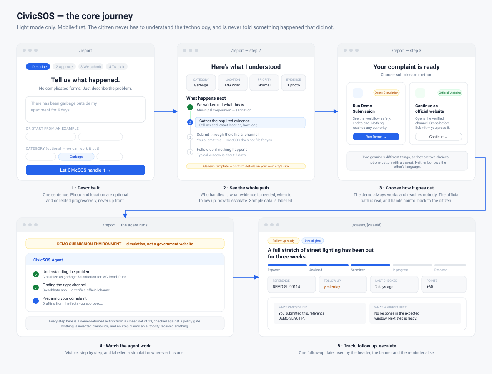
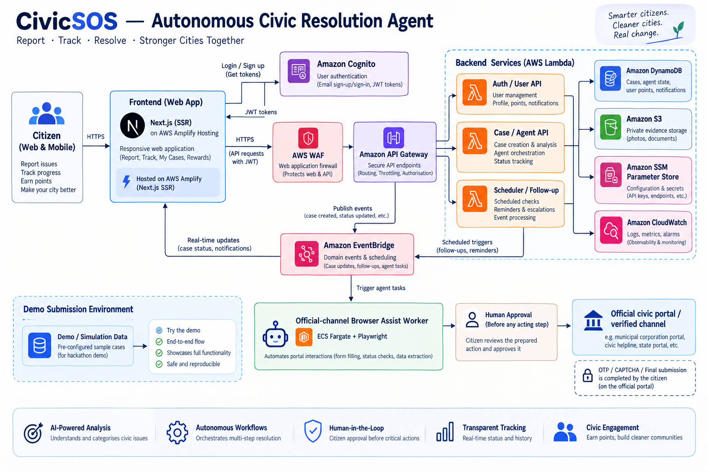

# CivicSOS

**Tell CivicSOS what happened. We'll handle the rest.**

Most people know exactly what is wrong on their street. Almost nobody knows which
department handles it, what evidence that department will ask for, what to write,
where to send it, how long to wait, or what to do when nothing happens.

CivicSOS closes that gap. It is an **autonomous civic resolution agent**: you
describe the problem and attach a photo, and it works out who is responsible,
checks your evidence is sufficient, writes the complaint, submits it once you
approve, captures the reference, watches for a response, and prepares the
follow-up and the escalation when nothing happens.

It is not a chatbot and not a directory. A language model helps read your
sentence; a deterministic rules engine and a gated agent do everything that
matters.

### Live

| | |
| --- | --- |
| **Frontend** | <https://main.ddwkb18wxep69.amplifyapp.com> — Amplify app `ddwkb18wxep69`, provisioned and configured, **awaiting its one-time GitHub authorization** (see [DEPLOYMENT.md](DEPLOYMENT.md#5-deploy-the-frontend)) |
| **API** | live, `GET /health` returns `{"status":"ok","stage":"prod"}` |
| **Region** | `ap-south-1` (Mumbai) |

The backend is deployed and serving. The frontend's Amplify app exists with its
environment wired to the API above; connecting the repository needs a browser
OAuth grant, which is the last step and the only one that cannot be scripted.

### The agent

```
you describe it  →  understand  →  route  →  check evidence  →  draft complaint
                                                                      ↓
   resolution  ←  escalate  ←  follow up  ←  monitor  ←  capture reference
                                                                      ↑
                                            submit  ←  YOU APPROVE  ←──┘
```

Two guarantees hold at every step, and both are enforced in code rather than
promised in copy:

1. **Nothing happens without approval.** Every acting step — preparing a
   submission, submitting, sending a follow-up — is refused by the policy layer
   unless the request carries the citizen's explicit approval.
2. **Nothing is claimed that did not happen.** There are two submission paths and
   they are never blurred:

   - **Demo Simulation** runs against the CivicSOS demo environment — a pure
     function with no HTTP client and no URL, so no demo run can reach a portal.
     Every reference is prefixed `CS-DEMO-`, every case is stamped
     `submissionMode: 'SIMULATED'`, and the UI says so on screen.
   - **Official Website** opens a *verified* official channel with the complaint
     prepared. CivicSOS stops before the final Submit; the citizen presses it,
     and the case is only marked submitted once they record the reference the
     authority gave them.

   See [SECURITY.md](SECURITY.md#11-the-agent).

The agent's action set is closed — thirteen named actions, nothing else — and a
model cannot invent an authority, a channel, a URL, a reference or a successful
submission, because none of those come from model output.

---

## Contents

| Document | What is in it |
| --- | --- |
| [ARCHITECTURE.md](ARCHITECTURE.md) | System design, request and async flows, data model, failure handling, tradeoffs |
| [SECURITY.md](SECURITY.md) | Threat model, authentication, authorization, AI safety, what is deliberately not solved |
| [API.md](API.md) | Endpoint reference, error contract, examples |
| [DEPLOYMENT.md](DEPLOYMENT.md) | Deploy, configure, verify, roll back |
| [COST.md](COST.md) | Why each AWS service was chosen and how runaway cost is prevented |
| [DEMO.md](DEMO.md) | The three-minute demo script |
| [docs/openapi.json](docs/openapi.json) | Generated OpenAPI 3.1 document |
| [docs/wireframe.svg](docs/wireframe.svg) | The core journey across five screens |
| [docs/architecture.png](docs/architecture.png) | AWS architecture and the end-to-end agent flow |
| [apps/worker/README.md](apps/worker/README.md) | The status-check worker: what it does and what it refuses |
| [apps/extension/README.md](apps/extension/README.md) | The browser assistant and its verified-mapping policy |

---

## The problem

A pothole outside a school, uncollected waste for six days, a dark lane, muddy tap
water, a live wire hanging over a footpath. All of these have a responsible public
body, a process, and usually a published service window. None of that is
discoverable by the person affected.

The result is a predictable failure: the citizen either does nothing, or complains
into the wrong channel and gets no reply, and concludes the system does not work.
The information gap — not apathy — is the bottleneck.

## What CivicSOS does about it

```
Citizen describes the problem
  → understand and classify        (AI-assisted, rules-verified)
  → confirm the location           (typed, or coarse browser location)
  → identify the responsible body  (deterministic knowledge layer)
  → list the required evidence     (deterministic)
  → generate a complaint letter    (deterministic template, AI-improved prose)
  → show the official channel      (verified national channels + generic guidance)
  → create a tracked case
  → compute the follow-up date     (deterministic)
  → remind, daily sweep            (EventBridge schedule)
  → unlock escalation guidance     (deterministic, time-gated)
  → resolve, with the full history kept
```

Supported categories today: **roads and potholes**, **garbage and sanitation**,
**streetlights**, **water and sewerage**, **public safety hazards**. Adding a
category is a data change in the knowledge layer plus a resolution path — no
application code changes. See [ARCHITECTURE.md](ARCHITECTURE.md#extending-the-knowledge-layer).

### Screens

| Route | What it is |
| --- | --- |
| `/` | Home — the pitch, the categories, community impact |
| `/report` | **The primary journey.** Describe → understand → approve → agent submits → tracked |
| `/cases` | Dashboard: summary tiles, filters, scannable case rows |
| `/cases/[id]` | Case detail: phase, what the agent did and will do next, evidence, history |
| `/rewards` | Civic Points balance, citizen level, reward catalogue |
| `/profile` | Identity, level progress, impact, points activity |
| `/notifications` | Reminders, escalation windows, points earned |
| `/settings` | Details used to pre-fill complaints, privacy summary |
| `/admin` | Staff dashboard (ADMIN only) |
| `/about` | What CivicSOS is and is not |

Light mode only, mobile-first, one indigo accent. Colour is used where it means
something — teal for progress, amber for rewards, red only for genuine urgency —
and nowhere for decoration.

### Civic Points

Participation is rewarded, but only the *useful* kind: filing a report earns 50,
completing every required detail 10, adding verified evidence 10, and a problem
actually being **resolved** 100. Points cannot be farmed by filing thin reports.

Every award is calculated on the server and written through an idempotent ledger
keyed `<reason>#<caseId>`, so a reason can be earned at most once per case however
many times the request is replayed — and because case creation is itself
idempotent, resubmitting the same report cannot mint a second award. Nothing
about points is ever read from a request body; a profile update that tries to set
its own balance is ignored. Citizen levels (Bronze → Silver → Gold → Community
Champion) are driven by *lifetime* points, so redeeming a reward never demotes
anyone.

The reward catalogue ships as a **placeholder with fictional partners**, flagged
in the data and badged in the UI. CivicSOS has no confirmed sponsors, redemption
issues an obviously-fake `DEMO-` code, and no commerce API or payment flow is
involved. Swapping in real partners is a data change plus one function.

### The differentiator: "What happens next?"

Every case answers, on one screen: what happened, who handles it, what you need,
what to do now, what happens after submission, the expected response window, when
to follow up, and what to do if it is unresolved — as a timeline where exactly one
step is marked **Do this now**.

## What CivicSOS is honest about

This matters more than any feature, because a civic tool that bluffs is worse than
no tool:

- **It does not file complaints for you.** You submit through the official
  channel; CivicSOS records that you did and tracks what follows.
- **It ships no verified directory of city offices.** Department records are
  generic *templates*, labelled "Generic guidance" in the UI, alongside a small
  set of genuinely official national channels (CPGRAMS, the Swachhata app, the
  112 emergency line, the NHAI highway helpline) labelled "Official channel".
  No phone number or city URL is ever invented.
- **It is not a government service** and is not affiliated with any government body.
- **Demo data is unmistakable.** Sample cases carry a `Demo data` badge, a
  persistent session banner, and are counted separately in the admin dashboard.
- **The reward catalogue is a placeholder.** Fictional partners, `DEMO-` codes,
  and a notice saying so on the page. No sponsor is claimed.
- **Community impact figures on the home page are labelled illustrative** —
  they are not presented as live platform statistics.
- **When the AI is unavailable, it says so** and falls back to its own rules
  rather than silently degrading.

## The journey, screen by screen



## Architecture in one picture



Everything above is serverless and scales to zero. The one container — the
browser-assist worker — is an on-demand Fargate task that exists only while a
batch is being checked.

Two boxes in that diagram are built and tested but **not yet live**, and it is
worth saying so rather than letting the picture imply otherwise. The **WAF** web
ACL exists in us-east-1 but is attached to nothing: it cannot attach to an HTTP
API, so it waits on CloudFront account verification. The **ECS Fargate** worker
deploys only with `-c enableWorker=true`. Everything else in the diagram is
deployed and serving today.

Secrets live in SSM Parameter Store as SecureString parameters and are read once
per Lambda container. Nothing secret is in the repository, the CloudFormation
template, or Lambda's visible environment configuration.

## AWS services, and why each one

| Service | Role | Why this one |
| --- | --- | --- |
| **Amplify Hosting** | Serves the Next.js app | Git-driven builds, CDN, TLS, generous free tier |
| **API Gateway (HTTP API)** | Public API edge, throttling, CORS | ~1/3 the price of REST API; throttling is the primary cost guard |
| **Lambda** | All compute | Scales to zero; no idle cost. arm64 for a cheaper GB-second |
| **DynamoDB** | All persistence | On-demand billing, single-table design, every access pattern is a query |
| **S3** | Evidence storage | Private bucket; bytes go browser↔S3 directly, never through Lambda |
| **Cognito** | Accounts, roles | Free tier covers real usage; groups are the source of truth for roles |
| **EventBridge** | Async fan-out + daily schedule | One scheduled sweep instead of per-case timers |
| **CloudWatch** | Structured logs, alarms | 1-week retention; alarms on errors and on unusual volume |
| **SSM Parameter Store** | Secrets | SecureString is free; Secrets Manager would cost ~$0.40/secret/month |
| **AWS Budgets** | Cost ceiling | First two budgets are free; alerts at 50% actual and 100% forecast |
| **WAF** | Managed rule groups + per-IP rate limit | Protects the API from abusive traffic and common web attacks |
| **ECS Fargate** | Status-check worker | Chromium does not fit Lambda well; on-demand tasks keep it scale-to-zero |

Deliberately **not** used: EC2, RDS, ElastiCache, EKS, **NAT Gateway**,
OpenSearch, Step Functions, Secrets Manager, or anything else that bills while
idle. Fargate is the single exception to the "no containers" rule and earns it:
a browser genuinely does not fit in Lambda, the task runs about three minutes a
day, and its VPC is configured `natGateways: 0` so nothing bills hourly. Full
reasoning, including a per-service cost estimate, in [COST.md](COST.md).

## The role of Gemini

Gemini (free tier, `gemini-2.0-flash`) does exactly four narrow things:

1. picks one of our **fixed** categories,
2. writes a neutral one-line summary,
3. rewrites the citizen's words into prose suitable for an official letter,
4. lists what information the citizen did not provide.

It decides **none** of: the responsible authority, required evidence, response
windows, follow-up dates, escalation policy, case status transitions, or
authorization. Those come from the rules engine.

The pipeline around it:

```
citizen text
  → prompt-injection scrub        (override phrases neutralized)
  → PII minimization              (phone, email, gov ID, house number removed)
  → Gemini, 8s budget, 1 retry    (temperature 0.1, responseSchema constrained)
  → strict zod validation         (hallucinated category ⇒ rejected)
  → reconciliation with keyword classifier
      agree            → use it
      keywords silent  → trust the model
      disagree         → keep the explainable answer, ask the citizen to confirm
  → urgency = max(rules, model)   (a model can never talk a hazard down)
  → deterministic rules engine builds the plan
```

Every failure mode — no key, timeout, rate limit, non-JSON, invented category,
prompt injection — falls back to the deterministic classifier and still produces a
complete plan. This is covered by tests, not just intent:
`packages/core/test/ai.test.ts`.

## Quick start

No AWS account and no API key needed to run the whole product locally.

```bash
git clone <this repo> && cd civicSOS
npm install
npm run dev
```

Open <http://localhost:3000> and click **Try the demo**. You land straight on the
report screen with a private, temporary session already seeded: four sample
cases (one deliberately old enough that escalation has unlocked), a points
balance partway to Silver Citizen, unread reminders in the bell, and a matching
points ledger.

In local mode the Next.js server runs the *same* router, services and rules as the
deployed Lambda, against in-memory adapters — so the code path you develop is the
code path that ships. Evidence upload genuinely works, with grant expiry and
content-type enforcement, against a local stand-in for S3.

Optional — enable real AI locally:

```bash
echo 'GEMINI_API_KEY=your-free-tier-key' > apps/web/.env.local
```

Trigger the reminder sweep without waiting a day:

```bash
curl -X POST http://localhost:3000/api/dev/sweep
```

## Verify

```bash
npm run verify     # typecheck all 6 workspaces, run every test, build web + extension + worker
npm test           # 216 tests: agent policy, providers, rules, AI fallback, auth, points, status checks
npm run lint       # ESLint across the web app
npm run openapi    # regenerate docs/openapi.json from the live route table
```

Current state: **216 passing** — 207 in `@civicsos/core`, 9 in `@civicsos/worker`.
`npm run verify` also re-checks both selector registries against the pages they
describe, so a renamed element fails the build instead of silently producing a
"verified" autofill that fills nothing, or a "verified" status read of a page
nobody looked at.

The suite covers the things that would actually hurt: cross-user access on every
read and write path, unauthenticated access to every private endpoint, malformed
and malicious AI responses, prompt injection, request size limits, path traversal
through ids, duplicate submissions, evidence that never finished uploading,
expired upload grants, escalation attempted too early, the reminder sweep's
idempotency, and — for the points system — replayed awards, client-supplied
balances, level gating, insufficient funds, and the guarantee that spending never
demotes a citizen.

For the agent specifically: submission refused without approval, refused twice on
the same case, refused on an incomplete complaint, refused on someone else's
case, refused on a closed case, and the guarantee that every reference it issues
is marked as simulated in three independent places.

For the status-check worker, the tests assert on what it *did not* touch: that a
sign-in wall or a CAPTCHA — whether present on load or appearing only after the
lookup — produces `NEEDS_HUMAN` with nothing typed and nothing clicked, that an
unregistered target is never visited, that only the citizen's own reference is
ever entered, and that "has not been resolved" is never read as resolved.

## Deploy

See [DEPLOYMENT.md](DEPLOYMENT.md) for the full procedure, including the two
secrets you must create yourself and the rollback path.

**Backend** — everything except the frontend and the optional worker:

```bash
npm run build -w @civicsos/core
npm run deploy:infra -- -c stage=prod \
  -c allowedOrigins=https://main.ddwkb18wxep69.amplifyapp.com \
  -c alertEmail=you@example.com
```

**Frontend** — Amplify builds from `amplify.yml` in this repository on every
push to `main`. The app and its environment variables already exist; connecting
the GitHub repository is a one-time browser authorization, described in
[DEPLOYMENT.md](DEPLOYMENT.md#5-deploy-the-frontend).

**Optional extras**, each off by default and each additive:

```bash
# WAF + CloudFront, once account verification clears
npm run cdk -- deploy --all

# The containerised status-check worker (needs Docker running locally)
npm run cdk -- deploy CivicSos-prod -c enableWorker=true
```

## Repository layout

```
packages/core/     Domain, validation, civic knowledge, rules engine, AI pipeline,
                   services, transport-agnostic HTTP router. No AWS SDK anywhere.
packages/aws/      Adapters for the core's ports (DynamoDB, S3, EventBridge,
                   Cognito, SSM) plus the three Lambda entry points.
packages/infra/    AWS CDK stack.
apps/extension/    Optional browser assistant: fills supported fields on verified
                   official portals. Never submits, never handles a login.
apps/worker/       Containerised Chromium (Playwright) that runs on demand as an
                   ECS Fargate task, reads a public complaint status page, and
                   reports what it saw. Files nothing; observes only.
apps/web/          Next.js 15 app, and the local in-memory API for development.
scripts/           OpenAPI generation.
docs/              Generated OpenAPI document.
```

The dependency direction is strictly one-way: `infra → aws → core`, and
`web → core`. Business logic never imports infrastructure.

## Licence

MIT.
